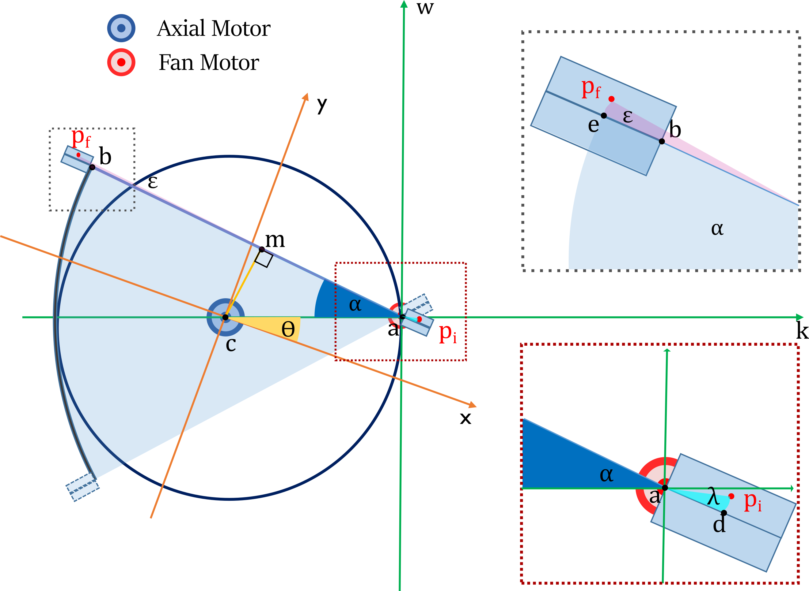
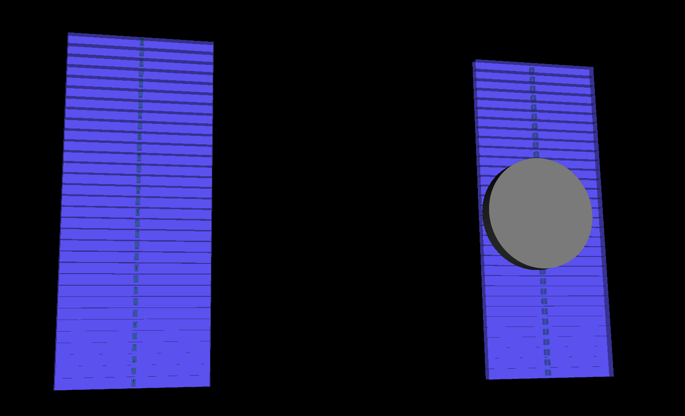

.. DO NOT EDIT.
.. THIS FILE WAS AUTOMATICALLY GENERATED BY SPHINX-GALLERY.
.. TO MAKE CHANGES, EDIT THE SOURCE PYTHON FILE:
.. "auto_examples\EasyPETCT\1_createNewDevice.py"
.. LINE NUMBERS ARE GIVEN BELOW.

.. only:: html

    .. note::
        :class: sphx-glr-download-link-note

        :ref:`Go to the end <sphx_glr_download_auto_examples_EasyPETCT_1_createNewDevice.py>`
        to download the full example code.

.. rst-class:: sphx-glr-example-title

.. _sphx_glr_auto_examples_EasyPETCT_1_createNewDevice.py:

EasyCT device creation
======================

This is an example how to create a new device. In this case a new system for EasyCT
The device should be run only one time to create a new device.  A folder with a unique identifier will be created
Afterwars the device can be read from the folder and added to the new TOR files created

# # sphinx_gallery_thumbnail_path = 'examples/EasyPETCT/easyPETCT.png'

.. GENERATED FROM PYTHON SOURCE LINES 21-22

Imports to create the device

.. GENERATED FROM PYTHON SOURCE LINES 22-34

.. code-block:: Python

    import matplotlib.pyplot as plt
    import numpy as np
    from scipy.optimize import curve_fit
    from Geometry.easyPETBased import EasyCTGeometry
    from DetectionLayout.Modules import easyPETModule
    from DetectionLayout.RadiationProducer import GenericRadiativeSource
    from Designer import DeviceDesignerStandalone
    from Device import StoreDeviceInFo, EnergyResolutionFunction
    from TORFilesReader import ToRFile
    from Corrections.General import DetectorSensitivityResponse

.. GENERATED FROM PYTHON SOURCE LINES 35-36

SYSTEM ENERGY RESPONSE FUNCTION (Not mandatory)

.. GENERATED FROM PYTHON SOURCE LINES 36-68

.. code-block:: Python

    def systemEnergyResponseFunction(E, Er, p1, p2):
        """
        Energy response function of the system
        :param energy: energy of the photon
        :param Er: energy resolution
        """
        fwhm = np.sqrt((p1 / E) ** 2 + (p2) ** 2)
        return fwhm / E

    energies = np.array([30, 59.6, 511])
    energy_resolution = np.array([0.63, 0.33, 0.14])

    fit = curve_fit(systemEnergyResponseFunction, energies, energy_resolution)
    plt.figure()
    plt.plot(energies, energy_resolution * 100, 'ro', label='Data')
    plt.plot(np.arange(25, 600, 10), systemEnergyResponseFunction(np.arange(25, 600, 10), *fit[0]) * 100, 'b-', label='Fit')
    plt.xlabel('Energy (keV)')
    plt.ylabel('Energy Resolution (%)')
    plt.legend()
    plt.savefig("../../images/system_energy_response_function.png")

    # .. image:: ../../images/system_energy_response_function.png
    #     :alt: EasyCT Diagram
    #     :width: 400px
    #     :align: center

    energy_window = [energies - energies * systemEnergyResponseFunction(energies, *fit[0]),
                     energies + energies * systemEnergyResponseFunction(energies, *fit[0])]
    systemEnergyResolution = EnergyResolutionFunction(p1=fit[0][1], p2=fit[0][2])

.. image-sg:: /auto_examples/EasyPETCT/images/sphx_glr_1_createNewDevice_001.png
   :alt: 1 createNewDevice
   :srcset: /auto_examples/EasyPETCT/images/sphx_glr_1_createNewDevice_001.png
   :class: sphx-glr-single-img

.. rst-class:: sphx-glr-script-out

 .. code-block:: none

    C:\Users\pedro\OneDrive\Documentos\GitHub\Infinity-Tomographic-Reconstruction\docs\source\examples\EasyPETCT\1_createNewDevice.py:49: OptimizeWarning: Covariance of the parameters could not be estimated
      fit = curve_fit(systemEnergyResponseFunction, energies, energy_resolution)

.. GENERATED FROM PYTHON SOURCE LINES 69-72

Setup the type of the detector module. You should not call the PETModule class directly.
This object  should entry as  argument in the geometry class type for proper setting. This allows to set multiple
cells. Number of modules, rotations and translations are set after the geometry class is created.

.. GENERATED FROM PYTHON SOURCE LINES 72-74

.. code-block:: Python

    _module = easyPETModule

.. GENERATED FROM PYTHON SOURCE LINES 75-81

Setup the x-ray source

Now we define the characteristics of the x-ray source using the `GenericRadiativeSource` class.
The source is set to be an Am-241 source with a focal spot diameter of 1 mm, and the shielding is set to be a
cylinder made of lead with a density of 11.34 g/cm³ and a thickness of 0.5 mm.
Set x-ray producer object

.. GENERATED FROM PYTHON SOURCE LINES 81-95

.. code-block:: Python

    xrayproducer = GenericRadiativeSource()
    xrayproducer.setSourceName("Am-241")
    xrayproducer.setSourceActivity(1.0 * 37000)
    xrayproducer.setFocalSpotDiameter(1)
    xrayproducer.setShieldingShape("Cylinder")
    xrayproducer.setShieldingMaterial("Lead")
    xrayproducer.setShieldingDensity(11.34)
    xrayproducer.setShieldingThickness(0.5)
    xrayproducer.setShieldingHeight(4)
    xrayproducer.setShieldingRadius(12.5)
    xrayproducer.setMainEmissions({1: {"energy": 59.54, "intensity": 0.36},
                                   2: {"energy": 26.34, "intensity": 0.024},
                                   })

.. GENERATED FROM PYTHON SOURCE LINES 96-100

The next step  is to choose the geometry type, which is `EasyCTGeometry` in this case. This function is inherited
from the DualRotationGeometry class which is an Device Object. Here we set the distance between the two points of rotation,
the distance between the fan motor and the detector modules (closest side) and the distance between the fan motor and the detector modules (far side).
as well as the initial position of the x-ray source.

.. GENERATED FROM PYTHON SOURCE LINES 100-113

.. code-block:: Python

    newDevice = EasyCTGeometry(detector_moduleA=_module, detector_moduleB=_module, x_ray_producer=xrayproducer)
    newDevice.setDeviceName("EasyCT")
    newDevice.setDeviceType("CT")
    newDevice.setEnergyResolutionFunction(systemEnergyResolution)  # use to apply energy cuts
    newDevice.setDistanceBetweenMotors(30)  # Distance between the two points of rotation
    newDevice.setDistanceFanMotorToDetectorModulesOnSideA(
        0)  # Distance between the fan motor and the detector modules (closest side)
    newDevice.setDistanceFanMotorToDetectorModulesOnSideB(
        60)  # Distance between the fan motor and the detector modules (far side)
    newDevice.xRayProducer.setFocalSpotInitialPositionWKSystem([12.55, 3, 0])
    newDevice.evaluateInitialSourcePosition()  # evaluate the initial position of the source

.. rst-class:: sphx-glr-script-out

 .. code-block:: none

    Calculating source position for all events detected...
    Focal spot initial position set to:  [[42.55       2.9999998  0.       ]]

.. GENERATED FROM PYTHON SOURCE LINES 114-121

Set modules Side A. For each module, should be in the list  the equivalent rotation and translation variables.
If for example two modules are set, the variables should be in the list as follows:
  moduleSideA_X_translation = np.array([15, 20], dtype=np.float32)
  moduleSideA_Y_translation = np.array([0, 0], dtype=np.float32)

  ...
Very important. The translations are regarding the fan motor center. The rotations are regarding the center of the module.

.. GENERATED FROM PYTHON SOURCE LINES 121-139

.. code-block:: Python

    newDevice.setNumberOfDetectorModulesSideA(1)

    moduleSideA_X_translation = np.array([15], dtype=np.float32)
    moduleSideA_Y_translation = np.array([0], dtype=np.float32)
    moduleSideA_Z_translation = np.array([0], dtype=np.float32)
    moduleSideA_alpha_rotation = np.array([0], dtype=np.float32)
    moduleSideA_beta_rotation = np.array([0], dtype=np.float32)
    moduleSideA_sigma_rotation = np.array([0], dtype=np.float32)

    for i in range(newDevice.numberOfDetectorModulesSideA):
        newDevice.detectorModulesSideA[i].model32()
        newDevice.detectorModulesSideA[i].setXTranslation(moduleSideA_X_translation[i])
        newDevice.detectorModulesSideA[i].setYTranslation(moduleSideA_Y_translation[i])
        newDevice.detectorModulesSideA[i].setZTranslation(moduleSideA_Z_translation[i])
        newDevice.detectorModulesSideA[i].setAlphaRotation(moduleSideA_alpha_rotation[i])
        newDevice.detectorModulesSideA[i].setBetaRotation(moduleSideA_beta_rotation[i])
        newDevice.detectorModulesSideA[i].setSigmaRotation(moduleSideA_sigma_rotation[i])

.. GENERATED FROM PYTHON SOURCE LINES 140-141

Set modules Side B.

.. GENERATED FROM PYTHON SOURCE LINES 141-158

.. code-block:: Python

    newDevice.setNumberOfDetectorModulesSideB(1)
    moduleSideB_X_translation = np.array([-75], dtype=np.float32)
    moduleSideB_Y_translation = np.array([0], dtype=np.float32)
    moduleSideB_Z_translation = np.array([0], dtype=np.float32)
    moduleSideB_alpha_rotation = np.array([0], dtype=np.float32)
    moduleSideB_beta_rotation = np.array([0], dtype=np.float32)
    moduleSideB_sigma_rotation = np.array([180], dtype=np.float32)

    for i in range(newDevice.numberOfDetectorModulesSideB):
        newDevice.detectorModulesSideB[i].model32()
        newDevice.detectorModulesSideB[i].setXTranslation(moduleSideB_X_translation[i])
        newDevice.detectorModulesSideB[i].setYTranslation(moduleSideB_Y_translation[i])
        newDevice.detectorModulesSideB[i].setZTranslation(moduleSideB_Z_translation[i])
        newDevice.detectorModulesSideB[i].setAlphaRotation(moduleSideB_alpha_rotation[i])
        newDevice.detectorModulesSideB[i].setBetaRotation(moduleSideB_beta_rotation[i])
        newDevice.detectorModulesSideB[i].setSigmaRotation(moduleSideB_sigma_rotation[i])

.. GENERATED FROM PYTHON SOURCE LINES 159-165

Set the inital coordinates of the system. In both coordinate

.. GENERATED FROM PYTHON SOURCE LINES 165-168

.. code-block:: Python

    newDevice.generateInitialCoordinatesWKSystem()
    newDevice.generateInitialCoordinatesXYSystem()

.. rst-class:: sphx-glr-script-out

 .. code-block:: none

    Calculating source position for all events detected...

.. GENERATED FROM PYTHON SOURCE LINES 169-170

Generate detector sensitivity response (It is necessary to create the device one time first then generate the TOR file for the white scan and then generate the new device)

.. GENERATED FROM PYTHON SOURCE LINES 170-181

.. code-block:: Python

    file_white_scan = "C:\\Users\\pedro\\OneDrive\\Ambiente de Trabalho\\listmode_whitescan_32x1 (1).tor"
    # load FILE
    ToRFile_sensitivity = ToRFile(filepath=file_white_scan)
    ToRFile_sensitivity.read()

    # comment this if the resolutionfucntion was not set
    detector_sensitivity = DetectorSensitivityResponse(TORFile=ToRFile_sensitivity, use_detector_energy_resolution=True)
    detector_sensitivity.setEnergyPeaks(energies)
    detector_sensitivity.setEnergyWindows()  # can set manually the energy windows. Put flag to use_detector_energy_resolution to False
    detector_sensitivity.setDetectorSensitivity()

.. rst-class:: sphx-glr-script-out

 .. code-block:: none

    Reading file: C:\Users\pedro\OneDrive\Ambiente de Trabalho\listmode_whitescan_32x1 (1).tor
    Energy windows:  [[ 10.8  49.2]
     [ 40.4  78.8]
     [491.8 530.2]]
    C:\Users\pedro\anaconda3\envs\test_env_spect\lib\site-packages\numpy\lib\_histograms_impl.py:895: RuntimeWarning: invalid value encountered in divide
      return n/db/n.sum(), bin_edges

.. GENERATED FROM PYTHON SOURCE LINES 182-183

Save the device in a folder with a unique identifier. The folder will be created in the current directory.

.. GENERATED FROM PYTHON SOURCE LINES 183-195

.. code-block:: Python

    modifyDevice = False
    if not modifyDevice:
        newDevice.generateDeviceUUID()  # one time only
        newDevice.createDirectory()  # one time only
        storeDevice = StoreDeviceInFo(device_directory=newDevice.deviceDirectory)  # one time only
        device_path = newDevice.deviceDirectory
    else:
        device_path = "C:\\Users\\pedro\\OneDrive\\Documentos\\GitHub\\Infinity-Tomographic-Reconstruction\\configurations\\08d98d7f-a3c1-4cdf-a037-54655c7bdbb7_EasyCT"
        storeDevice = StoreDeviceInFo(device_directory=device_path)  # one time only

    storeDevice.createDeviceInDirectory(object=newDevice)

.. rst-class:: sphx-glr-script-out

 .. code-block:: none

    Device created successfully

.. GENERATED FROM PYTHON SOURCE LINES 196-199

----------
TESTS PART
Design the system at the initial position

.. GENERATED FROM PYTHON SOURCE LINES 199-206

.. code-block:: Python

    readDevice = StoreDeviceInFo(device_directory=device_path)  # read the device saved
    newDevice_Read = readDevice.readDeviceFromDirectory()

    designer = DeviceDesignerStandalone(device=newDevice)
    designer.addDevice()
    designer.addxRayProducerSource()
    designer.startRender()

.. GENERATED FROM PYTHON SOURCE LINES 207-211

.. GENERATED FROM PYTHON SOURCE LINES 213-214

Test some initial positions of the source and the detectors

.. GENERATED FROM PYTHON SOURCE LINES 214-219

.. code-block:: Python

    unique_header = np.repeat(np.arange(0, 32), 13)
    axial_motor_angles = (np.zeros(32 * 13))
    fan_motor_angles = np.tile(np.arange(-90, 105, 15), 32)

.. GENERATED FROM PYTHON SOURCE LINES 220-221

Calculate the coordinates for the previous angles

.. GENERATED FROM PYTHON SOURCE LINES 221-253

.. code-block:: Python

    newDevice.detectorSideBCoordinatesAfterMovement(axial_motor_angles, fan_motor_angles, unique_header)

    axial_motor_angles = np.array([0, 0], dtype=np.float32)
    fan_motor_angles = np.array([0, 0], dtype=np.float32)
    newDevice.sourcePositionAfterMovement(axial_motor_angles, fan_motor_angles)
    plt.figure(figsize=(10, 10))
    plt.plot(newDevice.originSystemWZ[0], newDevice.originSystemWZ[1], 'ro', label='Origin Fan Motor')
    # plot source center
    plt.plot(newDevice.sourceCenter[:, 0], newDevice.sourceCenter[:, 1], 'bo', label='Source Center')
    plt.plot(newDevice.originSystemXY[0], newDevice.originSystemXY[1], 'ko', label='Origin FOV')
    plt.plot(newDevice.centerFace[:, 0], newDevice.centerFace[:, 1], 'go', label='Center Face Detector Module B')
    plt.plot(newDevice._verticesB[:, :, 0], newDevice._verticesB[:, :, 1], 'mo', label='Vertices Base Detector Module B')

    plt.plot([np.ones(newDevice.centerFace.shape[0]) * newDevice.originSystemWZ[0, 0],
              newDevice.centerFace[:, 0]], [np.ones(newDevice.centerFace.shape[0]) * newDevice.originSystemWZ[1, 0],
                                            newDevice.centerFace[:, 1]], '-')
    plt.xlabel('X (mm)')
    plt.ylabel('Z (mm)')
    plt.legend()
    plt.figure(figsize=(10, 10))

    # x an Z direction
    plt.plot(newDevice.originSystemWZ[0], newDevice.originSystemWZ[2], 'ro', label='Origin Fan Motor')
    # plot source center
    plt.plot(newDevice.sourceCenter[:, 0], newDevice.sourceCenter[:, 2], 'bo', label='Source Center')
    plt.plot(newDevice.originSystemXY[0], newDevice.originSystemXY[2], 'ko', label='Origin FOV')
    plt.plot(newDevice.centerFace[:, 0], newDevice.centerFace[:, 2], 'go', label='Center Face Detector Module B')
    plt.plot(newDevice._verticesB[:, :, 0], newDevice._verticesB[:, :, 2], 'mo', label='Vertices Base Detector Module B')
    plt.xlabel('X (mm)')
    plt.ylabel('Y (mm)')
    plt.legend()
    plt.show()

.. rst-class:: sphx-glr-horizontal

    *

      .. image-sg:: /auto_examples/EasyPETCT/images/sphx_glr_1_createNewDevice_002.png
         :alt: 1 createNewDevice
         :srcset: /auto_examples/EasyPETCT/images/sphx_glr_1_createNewDevice_002.png
         :class: sphx-glr-multi-img

    *

      .. image-sg:: /auto_examples/EasyPETCT/images/sphx_glr_1_createNewDevice_003.png
         :alt: 1 createNewDevice
         :srcset: /auto_examples/EasyPETCT/images/sphx_glr_1_createNewDevice_003.png
         :class: sphx-glr-multi-img

.. rst-class:: sphx-glr-script-out

 .. code-block:: none

    Calculating parametric positions of the center and vertices of the detector for all events...
    Centroid calculated for all events...
    Vertice 0 calculated for all events...
    Vertice 1 calculated for all events...
    Vertice 2 calculated for all events...
    Vertice 3 calculated for all events...
    Vertice 4 calculated for all events...
    Vertice 5 calculated for all events...
    Vertice 6 calculated for all events...
    Vertice 7 calculated for all events...
    [[[ 31.000187    59.999996   -36.48      ]
      [ 31.00008     90.         -36.48      ]
      [ 28.999916    90.         -36.48      ]
      ...
      [ 31.00008     90.         -34.2       ]
      [ 28.999916    90.         -34.2       ]
      [ 28.999817    59.999996   -34.2       ]]

     [[ 15.436964    58.214413   -36.48      ]
      [  7.672291    87.19216    -36.48      ]
      [  5.74028     86.674484   -36.48      ]
      ...
      [  7.672291    87.19216    -34.2       ]
      [  5.74028     86.674484   -34.2       ]
      [ 13.504755    57.69668    -34.2       ]]

     [[  0.86618996  52.461613   -36.48      ]
      [-14.1339035   78.44232    -36.48      ]
      [-15.8660965   77.442245   -36.48      ]
      ...
      [-14.1339035   78.44232    -34.2       ]
      [-15.8660965   77.442245   -34.2       ]
      [ -0.8661823   51.46143    -34.2       ]]

     ...

     [[ -0.86618423 -51.461426    34.2       ]
      [-15.866093   -77.442245    34.2       ]
      [-14.1339     -78.44233     34.2       ]
      ...
      [-15.866093   -77.442245    36.48      ]
      [-14.1339     -78.44233     36.48      ]
      [  0.86618614 -52.461613    36.48      ]]

     [[ 13.504753   -57.69668     34.2       ]
      [  5.740282   -86.674484    34.2       ]
      [  7.6722927  -87.19216     34.2       ]
      ...
      [  5.740282   -86.674484    36.48      ]
      [  7.6722927  -87.19216     36.48      ]
      [ 15.436962   -58.214413    36.48      ]]

     [[ 28.999813   -59.999996    34.2       ]
      [ 28.99992    -90.          34.2       ]
      [ 31.000084   -90.          34.2       ]
      ...
      [ 28.99992    -90.          36.48      ]
      [ 31.000084   -90.          36.48      ]
      [ 31.000183   -59.999996    36.48      ]]]
    Calculating source position for all events detected...

.. rst-class:: sphx-glr-timing

   **Total running time of the script:** (0 minutes 13.489 seconds)

.. _sphx_glr_download_auto_examples_EasyPETCT_1_createNewDevice.py:

.. only:: html

  .. container:: sphx-glr-footer sphx-glr-footer-example

    .. container:: sphx-glr-download sphx-glr-download-jupyter

      :download:`Download Jupyter notebook: 1_createNewDevice.ipynb <1_createNewDevice.ipynb>`

    .. container:: sphx-glr-download sphx-glr-download-python

      :download:`Download Python source code: 1_createNewDevice.py <1_createNewDevice.py>`

    .. container:: sphx-glr-download sphx-glr-download-zip

      :download:`Download zipped: 1_createNewDevice.zip <1_createNewDevice.zip>`

.. only:: html

 .. rst-class:: sphx-glr-signature

    `Gallery generated by Sphinx-Gallery <https://sphinx-gallery.github.io>`_
